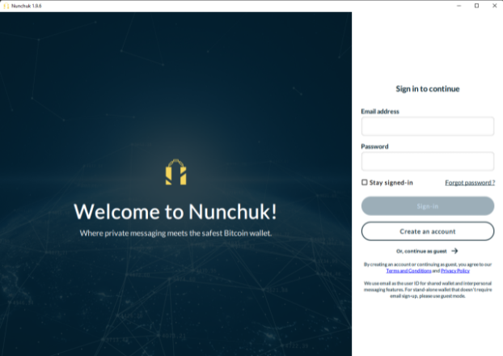

### Download Nunchuk

[Desktop](https://nunchuk.io/#Download)

[iOS](https://apps.apple.com/us/app/nunchuk-bitcoin-wallet/id1563190073)

[Android](https://play.google.com/store/apps/details?id=io.nunchuk.android)



  
   
  1. Right click your downloaded zip file and select "Extract All".
   
   
  
  
  

   
  
  2. Extract the files to your desktop or a known location that you prefer. (Example: Desktop)

  
  Take note of where you extract your files. You will need to relocate them when you want to run Nunchuk!
  

  3. Navigate to the location you extracted the files to. 
   
   

  4. Double click the new folder "nunchuk-windows". 
   
   

  5. Double click the nunchuk shortcut. 
   
   
    

  
  If the shortcut did not work, you can search for "nunchuk-client-qt.exe" and run that instead!
  

    Congratulations, you just launched Nunchuk!
     
     
    

  

  
  Insert MacOS workflow here!
  

  
  Insert Linux OS workflow here!
  



