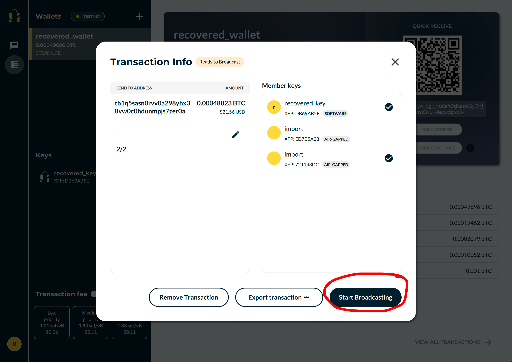

### Table of contents
* [Overview](#overview)
* [Step 1: Download the Nunchuk app and log in using Guest mode](#step1)
* [Step 2: Make sure that you are on mainnet](#step2)
* [Step 3: Recover your key(s)](#step3)
* [Step 4: Recover your wallet](#step4)
* [Step 5: Cooperatively spend from the wallet](#step5)
* [Step 6: Clean up](#step6)

### Overview 

A collaborative wallet is one where you manage bitcoin with other people. Each member of the wallet possesses one or more keys.

To recover a collaborative wallet, you will need:
* The **seed phrase(s)** for several members' keys - depending on how the wallet was configured, you might not need all seed phrases
* The **wallet configuration file**
* A way of **exchanging files out-of-band**, such as email, messaging apps or SD cards

A collaborative wallet recovery will require the cooperation of several members of the wallet in order to create, sign and broadcast transactions. This is in contrast with [personal wallet recovery]() where you can perform the recovery by yourself.

**The number of seed phrases you will need is the same as the number of signatures required to unlock the wallet.** For example: for a 3-of-5 multisig wallet, you will need 3 seed phrases for recovery.


  Seed phrases are defined in [BIP-0039 specification](https://github.com/bitcoin/bips/blob/master/bip-0039.mediawiki).



  The wallet configuration file has a .bsms extension and is defined in [BIP-0129 specification](https://github.com/bitcoin/bips/blob/master/bip-0129.mediawiki).



  For simplicity, this is a "clean slate" recovery. It assumes that the users have no prior data except for the seed phrases and the wallet configuration file. It uses Guest mode, which does not require any accounts.



  Any key that has a passphrase must be recovered using both the seed phrase and the passphrase.



  This recovery guide uses the Nunchuk desktop app. The same process can be done using the Nunchuk mobile apps.



  **[IMPORTANT]** Steps 1-4 and 6 should be carried out individually by each member that participates in the recovery process. Step 5 should be done cooperatively as a group.


### Step 1: Download the Nunchuk app and log in using Guest mode 
Download the app from our website: https://nunchuk.io/#Download.

Log in as Guest.

### Step 2: Make sure that you are on mainnet 

### Step 3: Recover your key(s) 

Recover your keys one-by-one by entering the seed phrase for each key.


  Unless a member is willing to transfer their signing privileges to another member (and therefore disclosing their seed phrase(s) to that member), each member that participates in the recovery process should only recover their own key(s).


### Step 4: Recover your wallet 

Recover your collaborative wallet by importing the wallet configuration file (.bsms). Remember to name the wallet before selecting a file to import.

After the import, you should see the wallet show up in the list of wallets. Select the wallet and wait for it to finish syncing.


  If the wallet's transaction history and balance are still not up-to-date after a while, try restarting the app.


### Step 5: Cooperatively spend from the wallet 

Hurrah, you have recovered the wallet! You can now proceed to withdraw your bitcoin. This step must be done together as a group.

One member in the group should initiate a Send transaction, sign off on that transaction using his key(s), and export the transaction as a PSBT file. (PSBT stands for Partially-Signed Bitcoin Transaction and is defined in [BIP-0174 specification](https://github.com/bitcoin/bips/blob/master/bip-0174.mediawiki)).

The group then should form a chain: each member gets a PSBT file from a previous member (starting from the transaction creator), adds their signature to it, and then passes on the modified PSBT file to the next member, and so on. Once the PSBT has collected enough signatures, it can be broadcast by the last member.

For example, if there are 3 members A, B and C involved in the recovery, and 3 signatures are required, here is how the process works:
* A creates the Send transaction, signs it, and exports it as a file named **A.psbt**
* A passes **A.psbt** onto B
* B imports **A.psbt**, signs it, and exports it as a new file named **A+B.psbt**
* B passes on **A+B.psbt** onto C
* C imports **A+B.psbt** and signs it - the transaction now has 3 signatures from A, B and C
* C broadcasts the transaction

The medium of file exchange could be email, messaging apps, or SD cards. An encrypted medium is recommended for better privacy.


  To drain the entire wallet, remember to tick the "Send all" box when creating the Send transaction.



  When the number of signatures required is large, it might be faster to sign in parallel instead of sequentially. In that case, the transaction creator should send out an unsigned PSBT, collect the signed PSBTs from the individual members, import them into his own wallet, and finally does the broadcast himself.


#### (A) Create a Send transaction

#### (B) Sign and export PSBT

#### (C) import PSBT

#### (D) Repeat (C)-(B) as many times as needed, then broadcast

### Step 6: Clean up 

To wipe all data used during the recovery process, each member should remove the wallet first, and then all of the keys.

