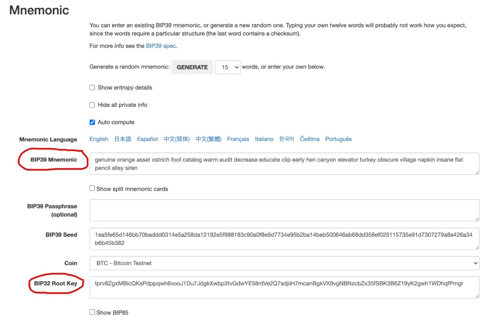
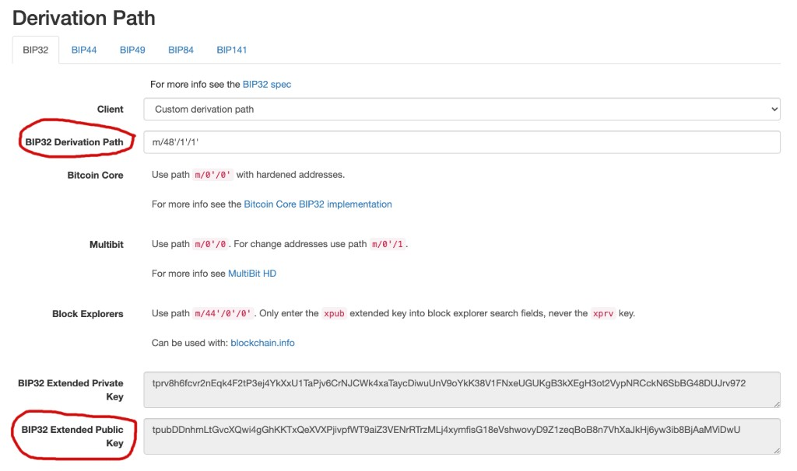

Nunchuk is built on open tools and standards. That means you can recover your Nunchuk wallets using other freely available software.

This guide shows you how to recover a Nunchuk wallet using [Bitcoin Core](https://github.com/bitcoin/bitcoin).

### Table of contents
* [Overview](#overview)
* [Step 1: Download, install, and sync Bitcoin Core](#step1)
* [Step 2: Download BIP39-Master Key conversion tool](#step3)
* [Step 3: Extract the master keys](#step3)
* [Step 4: Construct the wallet descriptors](#step4)
* [Step 5: Recover your wallet](#step5)
* [Step 6: Spend from the wallet](#step6)
* [Step 7: Clean up](#step7)

### Overview <a name="overview"></a>

What you need:
* The **seed phrase(s)** for your key(s)
* The **wallet configuration file**
* **Bitcoin Core**
* **BIP39 conversion tool**

**The number of seed phrases you will need is equal to the number of signatures required to unlock the wallet.** For examples: for a singlesig wallet, you will need exactly 1 seed phrase; for a 2-of-3 multisig wallet, you will need 2 seed phrases.


  Seed phrases are backups for your keys. They are defined in [BIP-0039](https://github.com/bitcoin/bips/blob/master/bip-0039.mediawiki).



  The wallet configuration file contains important information on how your wallet is constructed. It is defined in [BIP-0129](https://github.com/bitcoin/bips/blob/master/bip-0129.mediawiki).



  For simplicity, this is a "clean slate" recovery. It assumes that the user has nothing other than the seed phrases and the wallet configuration file.



  Any key that has a passphrase must be recovered using both the seed phrase and the passphrase.


### Step 1: Download, install, and sync Bitcoin Core <a name="step1"></a>
Download Bitcoin Core from https://bitcoincore.org. Verify the release using the provided signatures.

Alternatively, you can build Core manually, following the instructions at: https://github.com/bitcoin/bitcoin/tree/master/doc.

Add **bitcoind** and **bitcoin-cli** executables to your environment.

Sync a full node:

```bash
⟩ bitcoind -daemon # Starts the bitcoin daemon, syncing will begin
```


  Depending on your bandwidth, a full node could take up to a couple of days to sync.


### 2: Download BIP39-Master Key conversion tool <a name="step2"></a>

Download the offline BIP39 conversion tool at: https://github.com/iancoleman/bip39/releases. Verify the release using the provided signatures.

Alternatively, you can compile it manually.

Open the **bip39-standalone.html** file in a browser by double-clicking it.


  Make sure to use the offline version and never the online version at https://iancoleman.io/bip39. Using the online version can leak your private keys.


### Step 3: Extract the master keys <a name="step3"></a>

For each of your seed phrases, extract the master extended private key (master XPRIV) by doing the following:
* Set the **BIP39 Mnemonic** to your seed phrase
* Input the **passphrase** if you have one
* Make sure Coin is **BTC - Bitcoin**
* Note down your master key under **BIP32 Root Key**


  The reason we need to convert BIP39 seed phrases into master keys is because [Bitcoin Core does not support BIP39 seed phrases](https://bitcoin.stackexchange.com/a/88244).


Example seed phrase:
```bash
genuine orange asset ostrich foot catalog warm audit decrease educate clip early hen canyon elevator turkey obscure village napkin insane flat pencil alley siren
```

Corresponding master XPRIV:
```bash
tprv8ZgxMBicQKsPdppqwh6vooJ1Du7JdgkXwbp3tvGdwYE58rdVe2Q7sdjiiH7mcanBgkVX9vgNBNzcbZx35fSBK3B6Z19yK2gwh1WDhqfPmgr
```



### Step 4: Construct the wallet descriptors <a name="step4"></a>

Open the wallet configuration file (.bsms).

For example, here is a BSMS file. The descriptor template can be found on the second line:

```bash
BSMS 1.0
wsh(sortedmulti(1,[6b7c8e84/48'/1'/1']tpubDDnhmLtGvcXQwi4gGhKKTxQeXVXPjivpfWT9aiZ3VENrRTrzMLj4xymfisG18eVshwovyD9Z1zeqBoB8n7VhXaJkHj6yw3ib8BjAaMViDwU/**,[721143dc/48'/1'/2']tpubDD2nPnKDRg6NwikecMFyzPZRSBAKjR2FzcSe46mxWBByShLYwQ19zKpFPL8oMuuwibHXNfuRSknD22xWs7rqf9FShjm8d5SzNNTNpx3Z3kM/**))
/0/*,/1/*
tb1q5wvvjtmpaqpdjt669h2zfd5uvhm47kv8l049xqxpwfu24u9smu8sy72m8k
```


  [Output descriptors](https://bitcoinops.org/en/topics/output-script-descriptors), or descriptors for short, are strings that contain all the information necessary to track a wallet's addresses and transactions.


For each of the master keys extracted in step 3, **we will need to identify the corresponding XPUB and replace the XPUB with the master XPRIV**.

We see that the XPUBs in the template have the following derivation paths:

```bash
[6b7c8e84/48'/1'/1']
```

```bash
[721143dc/48'/1'/2']
```

Now, using the offline BIP39 conversion tool, under the Derivation Path section, choose **BIP32**. For each master key in step 3, enter one of the derivation paths above and see whether the resulting XPUB matches with one of the XPUBs in the descriptor template.

We see that the XPRIV that we noted down in step 3 corresponds to this XPUB:

```bash
[6b7c8e84/48'/1'/1']tpubDDnhmLtGvcXQwi4gGhKKTxQeXVXPjivpfWT9aiZ3VENrRTrzMLj4xymfisG18eVshwovyD9Z1zeqBoB8n7VhXaJkHj6yw3ib8BjAaMViDwU/**
````



Now for the XPUB in question: replace the master key fingerprint **6b7c8e84** with the XPRIV, remove the outside brackets **[]**, replace the **/\*\*** string with the receive derivation path (i.e., **/0/\***). Finally replace all **\'** with **h** within the template. We will get this new descriptor for receive addresses:

```bash
wsh(sortedmulti(1,tprv8ZgxMBicQKsPdppqwh6vooJ1Du7JdgkXwbp3tvGdwYE58rdVe2Q7sdjiiH7mcanBgkVX9vgNBNzcbZx35fSBK3B6Z19yK2gwh1WDhqfPmgr/48h/1h/1h/0/*,[721143dc/48h/1h/2h]tpubDD2nPnKDRg6NwikecMFyzPZRSBAKjR2FzcSe46mxWBByShLYwQ19zKpFPL8oMuuwibHXNfuRSknD22xWs7rqf9FShjm8d5SzNNTNpx3Z3kM/0/*))
```

Use **bitcoin-cli** to calculate the descriptor checksum (**#nvk258vn**):
```bash
⟩ bitcoin-cli getdescriptorinfo 'wsh(sortedmulti(1,tprv8ZgxMBicQKsPdppqwh6vooJ1Du7JdgkXwbp3tvGdwYE58rdVe2Q7sdjiiH7mcanBgkVX9vgNBNzcbZx35fSBK3B6Z19yK2gwh1WDhqfPmgr/48h/1h/1h/0/*,[721143dc/48h/1h/2h]tpubDD2nPnKDRg6NwikecMFyzPZRSBAKjR2FzcSe46mxWBByShLYwQ19zKpFPL8oMuuwibHXNfuRSknD22xWs7rqf9FShjm8d5SzNNTNpx3Z3kM/0/*))'
{
  "descriptor": "wsh(sortedmulti(1,tpubD6NzVbkrYhZ4XHrdqLmXDCx7nvdEo1wSWuQqBSJwMp2TyLtGGRDi48MatS3GxxnGr4ZUjtm2PCZEQ7A3H9gYSdZHDtMb2npk2ffDSxbF7yd/48'/1'/1'/0/*,[721143dc/48'/1'/2']tpubDD2nPnKDRg6NwikecMFyzPZRSBAKjR2FzcSe46mxWBByShLYwQ19zKpFPL8oMuuwibHXNfuRSknD22xWs7rqf9FShjm8d5SzNNTNpx3Z3kM/0/*))#m727lrwf",
  "checksum": "nvk258vn",
  "isrange": true,
  "issolvable": true,
  "hasprivatekeys": true
}
```

Repeat one more time to get the change addresses descriptor (**/1/\***) and its checksum (**#sdw5dkct**):

```bash
wsh(sortedmulti(1,tprv8ZgxMBicQKsPdppqwh6vooJ1Du7JdgkXwbp3tvGdwYE58rdVe2Q7sdjiiH7mcanBgkVX9vgNBNzcbZx35fSBK3B6Z19yK2gwh1WDhqfPmgr/48h/1h/1h/1/*,[721143dc/48h/1h/2h]tpubDD2nPnKDRg6NwikecMFyzPZRSBAKjR2FzcSe46mxWBByShLYwQ19zKpFPL8oMuuwibHXNfuRSknD22xWs7rqf9FShjm8d5SzNNTNpx3Z3kM/1/*))
```

```bash
⟩ bitcoin-cli getdescriptorinfo 'wsh(sortedmulti(1,tprv8ZgxMBicQKsPdppqwh6vooJ1Du7JdgkXwbp3tvGdwYE58rdVe2Q7sdjiiH7mcanBgkVX9vgNBNzcbZx35fSBK3B6Z19yK2gwh1WDhqfPmgr/48h/1h/1h/1/*,[721143dc/48h/1h/2h]tpubDD2nPnKDRg6NwikecMFyzPZRSBAKjR2FzcSe46mxWBByShLYwQ19zKpFPL8oMuuwibHXNfuRSknD22xWs7rqf9FShjm8d5SzNNTNpx3Z3kM/1/*))'
{
  "descriptor": "wsh(sortedmulti(1,tpubD6NzVbkrYhZ4XHrdqLmXDCx7nvdEo1wSWuQqBSJwMp2TyLtGGRDi48MatS3GxxnGr4ZUjtm2PCZEQ7A3H9gYSdZHDtMb2npk2ffDSxbF7yd/48'/1'/1'/1/*,[721143dc/48'/1'/2']tpubDD2nPnKDRg6NwikecMFyzPZRSBAKjR2FzcSe46mxWBByShLYwQ19zKpFPL8oMuuwibHXNfuRSknD22xWs7rqf9FShjm8d5SzNNTNpx3Z3kM/1/*))#cljqxj63",
  "checksum": "sdw5dkct",
  "isrange": true,
  "issolvable": true,
  "hasprivatekeys": true
}
```
 
### Step 5: Recover your wallet <a name="step5"></a>

Create a new descriptor wallet:
```bash
⟩ bitcoin-cli createwallet my_recovered_wallet false false "" false true 
{
  "name": "my_recovered_wallet",
  "warning": "Empty string given as passphrase, wallet will not be encrypted.\nWallet is an experimental descriptor wallet"
}
```

Import the receive & change descriptors into the wallet:
```bash
⟩ bitcoin-cli -rpcwallet=my_recovered_wallet importdescriptors '[{ "desc": "wsh(sortedmulti(1,tprv8ZgxMBicQKsPdppqwh6vooJ1Du7JdgkXwbp3tvGdwYE58rdVe2Q7sdjiiH7mcanBgkVX9vgNBNzcbZx35fSBK3B6Z19yK2gwh1WDhqfPmgr/48h/1h/1h/0/*,[721143dc/48h/1h/2h]tpubDD2nPnKDRg6NwikecMFyzPZRSBAKjR2FzcSe46mxWBByShLYwQ19zKpFPL8oMuuwibHXNfuRSknD22xWs7rqf9FShjm8d5SzNNTNpx3Z3kM/0/*))#nvk258vn", "active":true, "timestamp": 0, "internal": false, "range": 1000 }, { "desc": "wsh(sortedmulti(1,tprv8ZgxMBicQKsPdppqwh6vooJ1Du7JdgkXwbp3tvGdwYE58rdVe2Q7sdjiiH7mcanBgkVX9vgNBNzcbZx35fSBK3B6Z19yK2gwh1WDhqfPmgr/48h/1h/1h/1/*,[721143dc/48h/1h/2h]tpubDD2nPnKDRg6NwikecMFyzPZRSBAKjR2FzcSe46mxWBByShLYwQ19zKpFPL8oMuuwibHXNfuRSknD22xWs7rqf9FShjm8d5SzNNTNpx3Z3kM/1/*))#sdw5dkct", "active":true, "timestamp": 0, "internal": true, "range": 1000 }]'
[
  {
    "success": true,
    "warnings": [
      "Not all private keys provided. Some wallet functionality may return unexpected errors"
    ]
  },
  {
    "success": true,
    "warnings": [
      "Not all private keys provided. Some wallet functionality may return unexpected errors"
    ]
  }
]
```


  importdescriptors() will trigger a chain rescan to identify transactions in the wallet, which can take a long time. If you want to hasten this process, you can replace the import timestamp with a more recent timestamp (e.g. the wallet creation timestamp).


Check the wallet balance and make sure that the rescan has finished (**"scanning": false**) before moving on to the next step:
```bash
⟩ bitcoin-cli -rpcwallet=my_recovered_wallet getwalletinfo
{
  "walletname": "my_recovered_wallet",
  "walletversion": 169900,
  "format": "sqlite",
  "balance": 0.00088825,
  "unconfirmed_balance": 0.00000000,
  "immature_balance": 0.00000000,
  "txcount": 4,
  "keypoolsize": 3000,
  "keypoolsize_hd_internal": 3000,
  "paytxfee": 0.00000000,
  "private_keys_enabled": true,
  "avoid_reuse": false,
  "scanning": false,
  "descriptors": true
}
```

### Step 6: Spend from the wallet <a name="step6"></a>

Create a Send PSBT, using a custom fee rate (2 sat/vB):
```bash
⟩ bitcoin-cli -rpcwallet=my_recovered_wallet walletcreatefundedpsbt '[]' '{"tb1qy5l5ar3ue8xnz2zh65ntr7pvr4yqy3a5q277q7":0.00021}' 0 '{"fee_rate": 2}'
{
  "psbt": "cHNidP8BAH0CAAAAAT+hZVOO8niMbYnFXi1DprM2JQ2lw+SmztIPkk/LGgG8AQAAAAD9////AghSAAAAAAAAFgAUJT9OjjzJzTEoV9UmsfgsHUgCR7SF5AAAAAAAACIAIFuIRGp4N363BX/k00zXOlETDbpHJIWCNtOajd8yS4/NAAAAAAABAIkCAAAAAWkNb43bZJJ0psi+CfHHrZ3GQqgA4aNThtc85ci4yndWAQAAAAD9////AiBOAAAAAAAAIgAg3AUi2nPWUQARczY1jGmPpcpCfWgohEcMG2BWkuy+RTDRNwEAAAAAACIAICMKUFmOByMYYYyxInePfKg4wU49hSSYz5F7O54/fE3IAAAAAAEBK9E3AQAAAAAAIgAgIwpQWY4HIxhhjLEid498qDjBTj2FJJjPkXs7nj98TcgBBUdRIQKVukmo54vqwyEJibOp7VTnt8Abhn7eYR30KmY2diXzoCEDsfcAGXsFnBZ73BtU/W41TCGuyFKoBRRocWERulR9lt1SriIGApW6Sajni+rDIQmJs6ntVOe3wBuGft5hHfQqZjZ2JfOgGGt8joQwAACAAQAAgAEAAIABAAAAAAAAACIGA7H3ABl7BZwWe9wbVP1uNUwhrshSqAUUaHFhEbpUfZbdGHIRQ9wwAACAAQAAgAIAAIABAAAAAAAAAAAAAQFHUSEDeR2B9muPlujQeSzqCUT+MK7k+BMOAa6m+XdOrPdIPjQhA7bMSGL6KrzJDq3oy+NrWJj6jDZP9lwOVXTBx0ey5jBZUq4iAgN5HYH2a4+W6NB5LOoJRP4wruT4Ew4Brqb5d06s90g+NBhrfI6EMAAAgAEAAIABAACAAQAAAAIAAAAiAgO2zEhi+iq8yQ6t6Mvja1iY+ow2T/ZcDlV0wcdHsuYwWRhyEUPcMAAAgAEAAIACAACAAQAAAAIAAAAA",
  "fee": 0.00000324,
  "changepos": 1
}
```


  PSBT stands for Partially-Signed Bitcoin Transaction. It is defined in [BIP-0174](https://github.com/bitcoin/bips/blob/master/bip-0174.mediawiki).


If you want to drain the wallet, make sure that the send amount is equal to the wallet balance, and set the **"subtractFeeFromOutputs"** option to include one or more outputs.

```bash
⟩ bitcoin-cli -rpcwallet=my_recovered_wallet walletcreatefundedpsbt '[]' '{"tb1qy5l5ar3ue8xnz2zh65ntr7pvr4yqy3a5q277q7":0.00088825}' 0 '{"fee_rate": 2, "subtractFeeFromOutputs":[0]}'
```

Sign the PSBT:
```bash
⟩ bitcoin-cli -rpcwallet=my_recovered_wallet walletprocesspsbt "cHNidP8BAH0CAAAAAT+hZVOO8niMbYnFXi1DprM2JQ2lw+SmztIPkk/LGgG8AQAAAAD9////AghSAAAAAAAAFgAUJT9OjjzJzTEoV9UmsfgsHUgCR7SF5AAAAAAAACIAIFuIRGp4N363BX/k00zXOlETDbpHJIWCNtOajd8yS4/NAAAAAAABAIkCAAAAAWkNb43bZJJ0psi+CfHHrZ3GQqgA4aNThtc85ci4yndWAQAAAAD9////AiBOAAAAAAAAIgAg3AUi2nPWUQARczY1jGmPpcpCfWgohEcMG2BWkuy+RTDRNwEAAAAAACIAICMKUFmOByMYYYyxInePfKg4wU49hSSYz5F7O54/fE3IAAAAAAEBK9E3AQAAAAAAIgAgIwpQWY4HIxhhjLEid498qDjBTj2FJJjPkXs7nj98TcgBBUdRIQKVukmo54vqwyEJibOp7VTnt8Abhn7eYR30KmY2diXzoCEDsfcAGXsFnBZ73BtU/W41TCGuyFKoBRRocWERulR9lt1SriIGApW6Sajni+rDIQmJs6ntVOe3wBuGft5hHfQqZjZ2JfOgGGt8joQwAACAAQAAgAEAAIABAAAAAAAAACIGA7H3ABl7BZwWe9wbVP1uNUwhrshSqAUUaHFhEbpUfZbdGHIRQ9wwAACAAQAAgAIAAIABAAAAAAAAAAAAAQFHUSEDeR2B9muPlujQeSzqCUT+MK7k+BMOAa6m+XdOrPdIPjQhA7bMSGL6KrzJDq3oy+NrWJj6jDZP9lwOVXTBx0ey5jBZUq4iAgN5HYH2a4+W6NB5LOoJRP4wruT4Ew4Brqb5d06s90g+NBhrfI6EMAAAgAEAAIABAACAAQAAAAIAAAAiAgO2zEhi+iq8yQ6t6Mvja1iY+ow2T/ZcDlV0wcdHsuYwWRhyEUPcMAAAgAEAAIACAACAAQAAAAIAAAAA"
{
  "psbt": "cHNidP8BAH0CAAAAAT+hZVOO8niMbYnFXi1DprM2JQ2lw+SmztIPkk/LGgG8AQAAAAD9////AghSAAAAAAAAFgAUJT9OjjzJzTEoV9UmsfgsHUgCR7SF5AAAAAAAACIAIFuIRGp4N363BX/k00zXOlETDbpHJIWCNtOajd8yS4/NAAAAAAABAIkCAAAAAWkNb43bZJJ0psi+CfHHrZ3GQqgA4aNThtc85ci4yndWAQAAAAD9////AiBOAAAAAAAAIgAg3AUi2nPWUQARczY1jGmPpcpCfWgohEcMG2BWkuy+RTDRNwEAAAAAACIAICMKUFmOByMYYYyxInePfKg4wU49hSSYz5F7O54/fE3IAAAAAAEBK9E3AQAAAAAAIgAgIwpQWY4HIxhhjLEid498qDjBTj2FJJjPkXs7nj98TcgBCJIDAEcwRAIgPuM79gZVfjHUN2HMALr3rpEge7g5/xH85vOHo0P08BACIA7MIHNhhlVDcK7FMkmUz+5CRie10ctvLoNVALS+o1BAAUdRIQKVukmo54vqwyEJibOp7VTnt8Abhn7eYR30KmY2diXzoCEDsfcAGXsFnBZ73BtU/W41TCGuyFKoBRRocWERulR9lt1SrgAAAQFHUSEDeR2B9muPlujQeSzqCUT+MK7k+BMOAa6m+XdOrPdIPjQhA7bMSGL6KrzJDq3oy+NrWJj6jDZP9lwOVXTBx0ey5jBZUq4iAgN5HYH2a4+W6NB5LOoJRP4wruT4Ew4Brqb5d06s90g+NBhrfI6EMAAAgAEAAIABAACAAQAAAAIAAAAiAgO2zEhi+iq8yQ6t6Mvja1iY+ow2T/ZcDlV0wcdHsuYwWRhyEUPcMAAAgAEAAIACAACAAQAAAAIAAAAA",
  "complete": true
}
```

If the transaction has enough signatures, it will say **"complete": true**.

Finalize the PSBT:
```bash
⟩ bitcoin-cli -rpcwallet=my_recovered_wallet finalizepsbt "cHNidP8BAH0CAAAAAT+hZVOO8niMbYnFXi1DprM2JQ2lw+SmztIPkk/LGgG8AQAAAAD9////AghSAAAAAAAAFgAUJT9OjjzJzTEoV9UmsfgsHUgCR7SF5AAAAAAAACIAIFuIRGp4N363BX/k00zXOlETDbpHJIWCNtOajd8yS4/NAAAAAAABAIkCAAAAAWkNb43bZJJ0psi+CfHHrZ3GQqgA4aNThtc85ci4yndWAQAAAAD9////AiBOAAAAAAAAIgAg3AUi2nPWUQARczY1jGmPpcpCfWgohEcMG2BWkuy+RTDRNwEAAAAAACIAICMKUFmOByMYYYyxInePfKg4wU49hSSYz5F7O54/fE3IAAAAAAEBK9E3AQAAAAAAIgAgIwpQWY4HIxhhjLEid498qDjBTj2FJJjPkXs7nj98TcgBCJIDAEcwRAIgPuM79gZVfjHUN2HMALr3rpEge7g5/xH85vOHo0P08BACIA7MIHNhhlVDcK7FMkmUz+5CRie10ctvLoNVALS+o1BAAUdRIQKVukmo54vqwyEJibOp7VTnt8Abhn7eYR30KmY2diXzoCEDsfcAGXsFnBZ73BtU/W41TCGuyFKoBRRocWERulR9lt1SrgAAAQFHUSEDeR2B9muPlujQeSzqCUT+MK7k+BMOAa6m+XdOrPdIPjQhA7bMSGL6KrzJDq3oy+NrWJj6jDZP9lwOVXTBx0ey5jBZUq4iAgN5HYH2a4+W6NB5LOoJRP4wruT4Ew4Brqb5d06s90g+NBhrfI6EMAAAgAEAAIABAACAAQAAAAIAAAAiAgO2zEhi+iq8yQ6t6Mvja1iY+ow2T/ZcDlV0wcdHsuYwWRhyEUPcMAAAgAEAAIACAACAAQAAAAIAAAAA"
{
  "hex": "020000000001013fa165538ef2788c6d89c55e2d43a6b336250da5c3e4a6ced20f924fcb1a01bc0100000000fdffffff020852000000000000160014253f4e8e3cc9cd312857d526b1f82c1d480247b485e40000000000002200205b88446a78377eb7057fe4d34cd73a51130dba4724858236d39a8ddf324b8fcd030047304402203ee33bf606557e31d43761cc00baf7ae91207bb839ff11fce6f387a343f4f01002200ecc20736186554370aec5324994cfee424627b5d1cb6f2e835500b4bea35040014751210295ba49a8e78beac3210989b3a9ed54e7b7c01b867ede611df42a66367625f3a02103b1f700197b059c167bdc1b54fd6e354c21aec852a8051468716111ba547d96dd52ae00000000",
  "complete": true
}
```

Broadcast the raw transaction to the network:
```bash
⟩ bitcoin-cli -rpcwallet=my_recovered_wallet sendrawtransaction "020000000001013fa165538ef2788c6d89c55e2d43a6b336250da5c3e4a6ced20f924fcb1a01bc0100000000fdffffff020852000000000000160014253f4e8e3cc9cd312857d526b1f82c1d480247b485e40000000000002200205b88446a78377eb7057fe4d34cd73a51130dba4724858236d39a8ddf324b8fcd030047304402203ee33bf606557e31d43761cc00baf7ae91207bb839ff11fce6f387a343f4f01002200ecc20736186554370aec5324994cfee424627b5d1cb6f2e835500b4bea35040014751210295ba49a8e78beac3210989b3a9ed54e7b7c01b867ede611df42a66367625f3a02103b1f700197b059c167bdc1b54fd6e354c21aec852a8051468716111ba547d96dd52ae00000000"
b91276af8b6f5ede632aadfb87bf8a9209a43d0a030396cd0c4629a1ec92b87a
```


  This guide can be easily adjusted for collaborative wallets. Similar to [our other recovery guide](), each member of the collaborative wallet will need to sync their own full node, extract their master key(s) from their seed phrase(s), and create their own Core descriptor wallet. They would also need to exchange PSBTs out-of-band and individually sign using the **walletprocesspsbt** RPC command.


### Step 7: Clean up <a name="step7"></a>

To wipe all data used during the recovery process, open your Core **datadir** and find the wallet folder inside. It should have the same name as the wallet and contain a **wallet.dat** file.

Delete the wallet folder and empty it from the Trash bin.


