### Table of contents
* [Overview](#overview)
* [Step 1: Download the Nunchuk app and log in using Guest mode](#step1)
* [Step 2: Make sure that you are on mainnet](#step2)
* [Step 3: Recover your key(s)](#step3)
* [Step 4: Recover your wallet](#step4)
* [Step 5: Spend from the wallet](#step5)
* [Step 6: Clean up](#step6)

### Overview 

A personal wallet is one where you possess all keys inside the wallet.

To recover a personal wallet, you will need:
* The **seed phrase(s)** for your key(s) - depending on how the wallet was configured, you might not need all seed phrases
* The **wallet configuration file**

**The number of seed phrases you will need is the same as the number of signatures required to unlock the wallet.** For examples: for a 2-of-3 multisig wallet, you will need 2 seed phrases; for a singlesig wallet, you will need 1 seed phrase.


  Seed phrases are defined in [BIP-0039 specification](https://github.com/bitcoin/bips/blob/master/bip-0039.mediawiki).



  The wallet configuration file has a .bsms extension and is defined in [BIP-0129 specification](https://github.com/bitcoin/bips/blob/master/bip-0129.mediawiki).



  For simplicity, this is a "clean slate" recovery. It assumes that the user has no prior data except for the seed phrases and the wallet configuration file. It uses Guest mode, which does not require an account.



  Any key that has a passphrase must be recovered using both the seed phrase and the passphrase.



  This recovery guide uses the Nunchuk desktop app. The same process can be done using the Nunchuk mobile apps.


### Step 1: Download the Nunchuk app and log in using Guest mode 
Download the app from our website: https://nunchuk.io/#Download.

Log in as Guest.

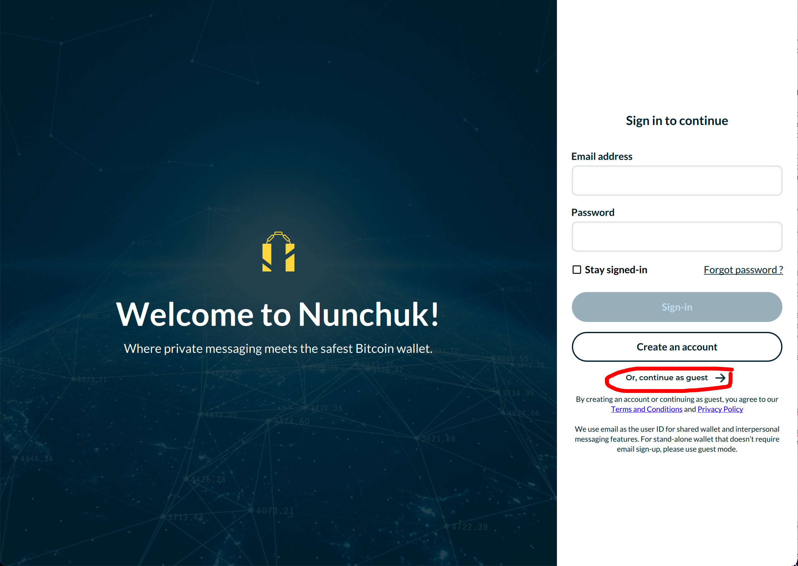

### Step 2: Make sure that you are on mainnet 

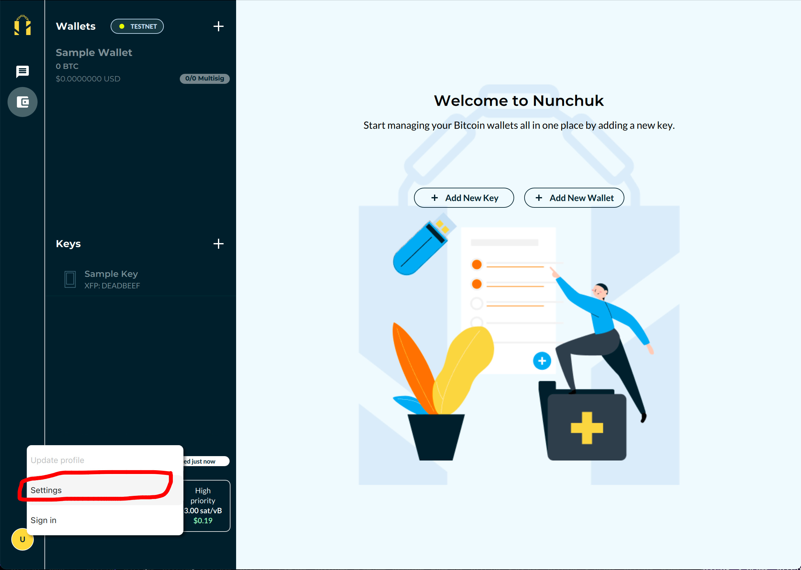
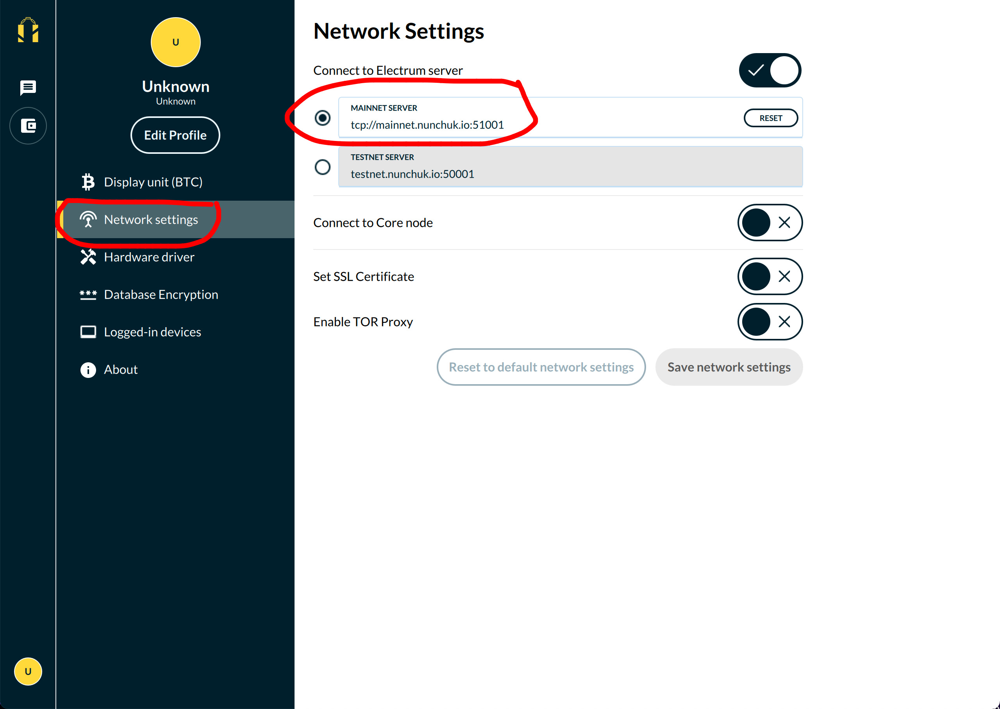

### Step 3: Recover your key(s) 

Recover your keys one-by-one by entering the seed phrase for each key. If you have a singlesig wallet, you will only need to recover one key.

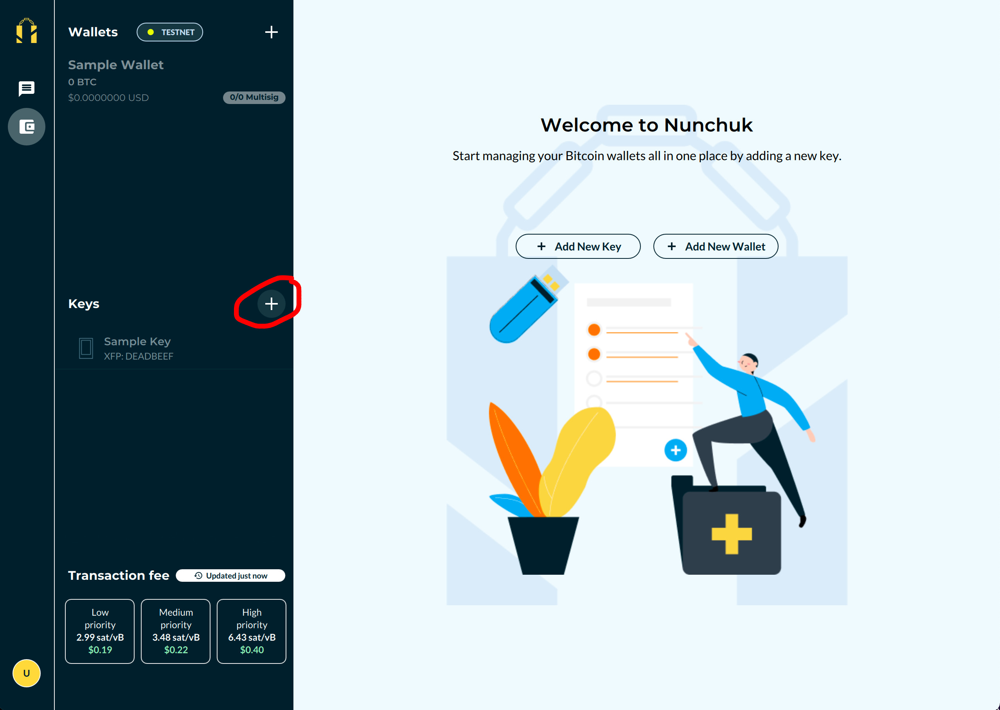
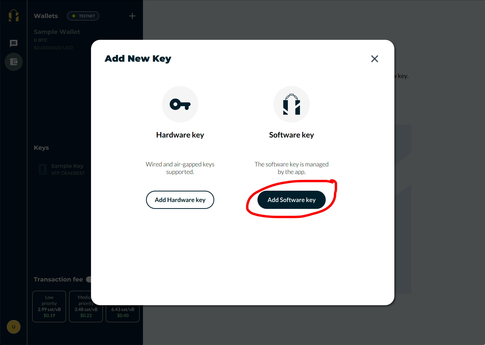
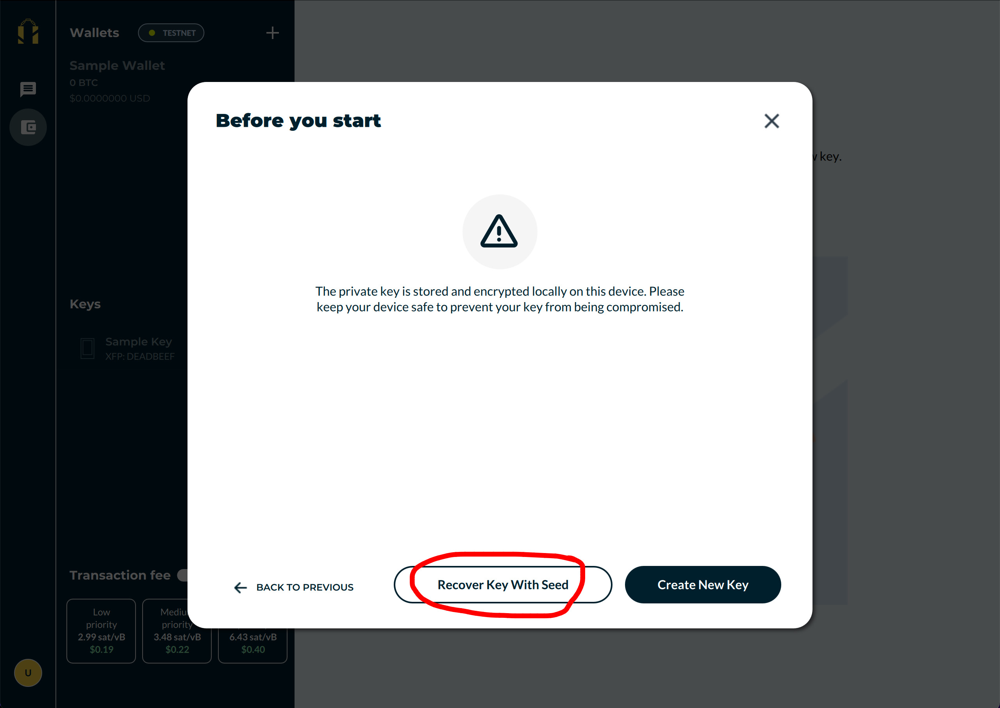

### Step 4: Recover your wallet 

Recover your wallet by importing the wallet configuration file (.bsms). Remember to name the wallet before selecting a file to import.

After the import, you should see the wallet show up in the list of wallets. Select the wallet and wait for it to finish syncing.


  If the wallet's transaction history and balance are still not up-to-date after a while, try restarting the app.


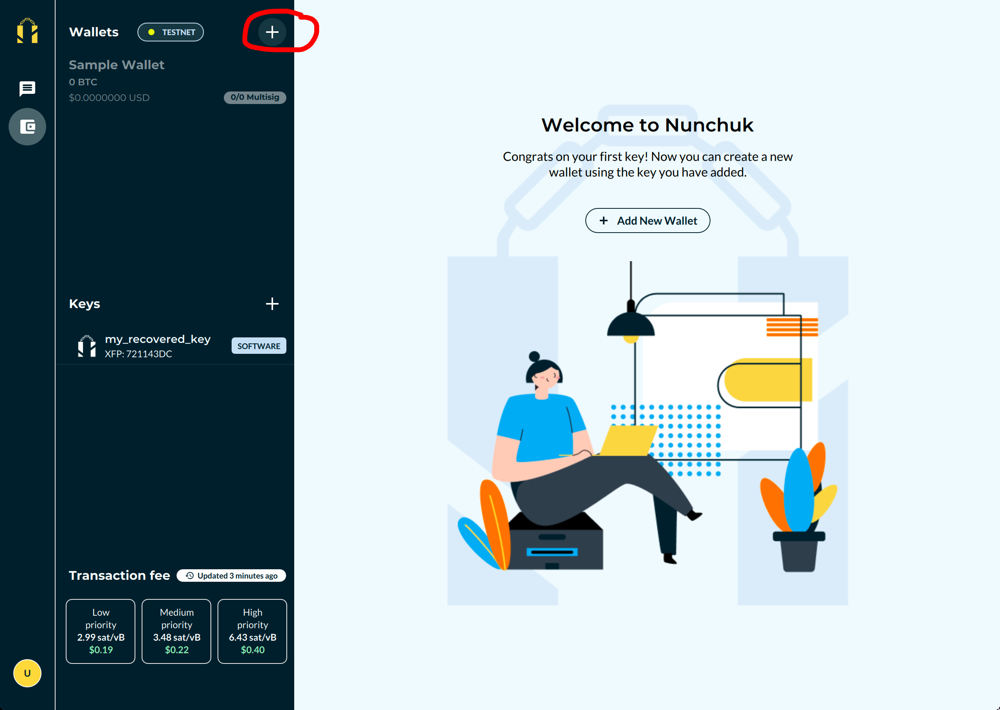
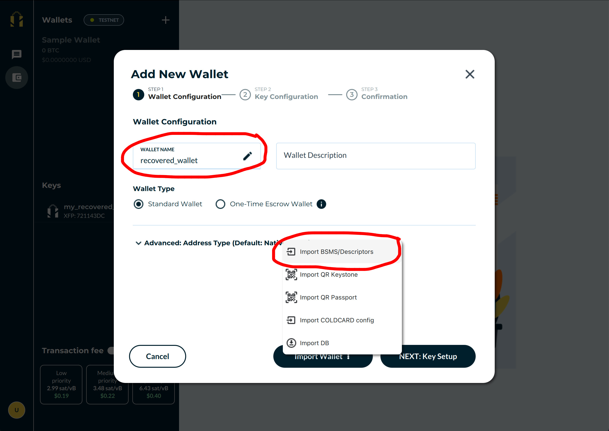

### Step 5: Spend from the wallet 

Hurrah, you have fully recovered the wallet! You can now proceed to withdraw your bitcoin.

Please double-check that the withdraw address is legitimate, sign the transaction with your recovered key(s), and wait for the transaction to confirm on the blockchain.


  To drain the entire wallet, remember to tick the "Send all" box when creating the Send transaction.


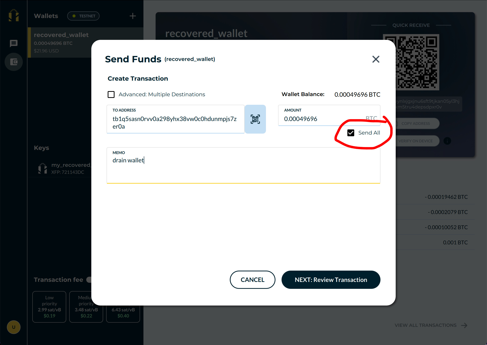

### Step 6: Clean up 

To wipe all data used during the recovery process, remove the wallet first, then all of the keys.

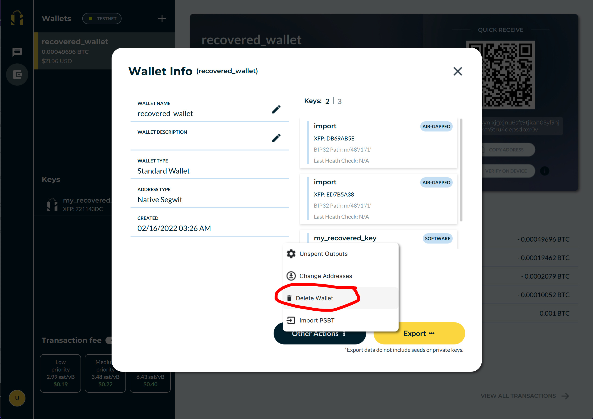
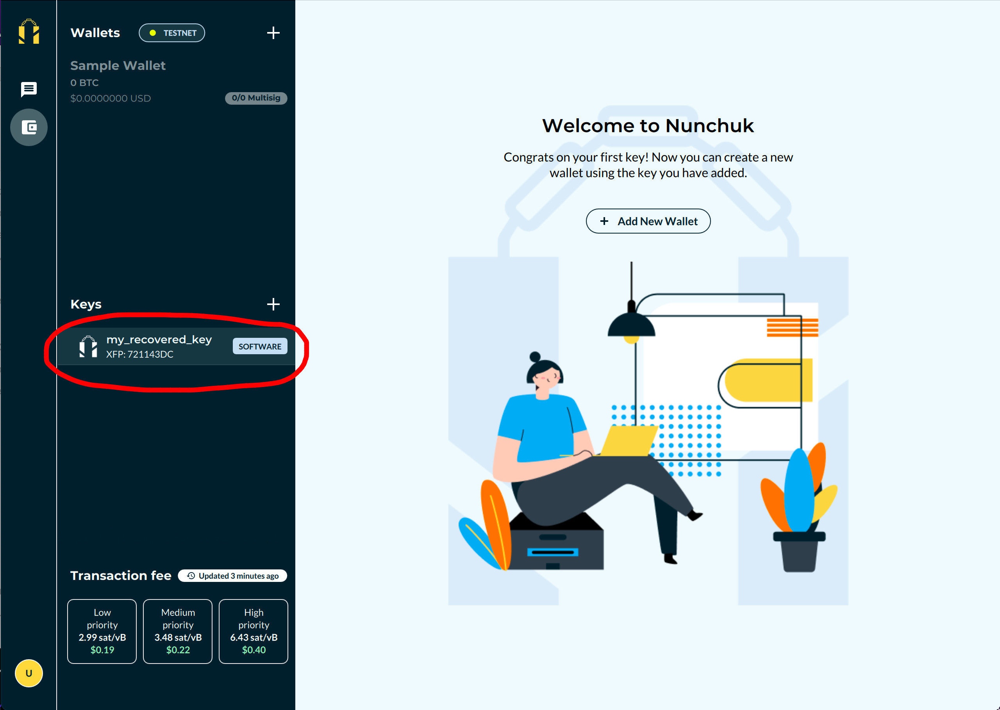
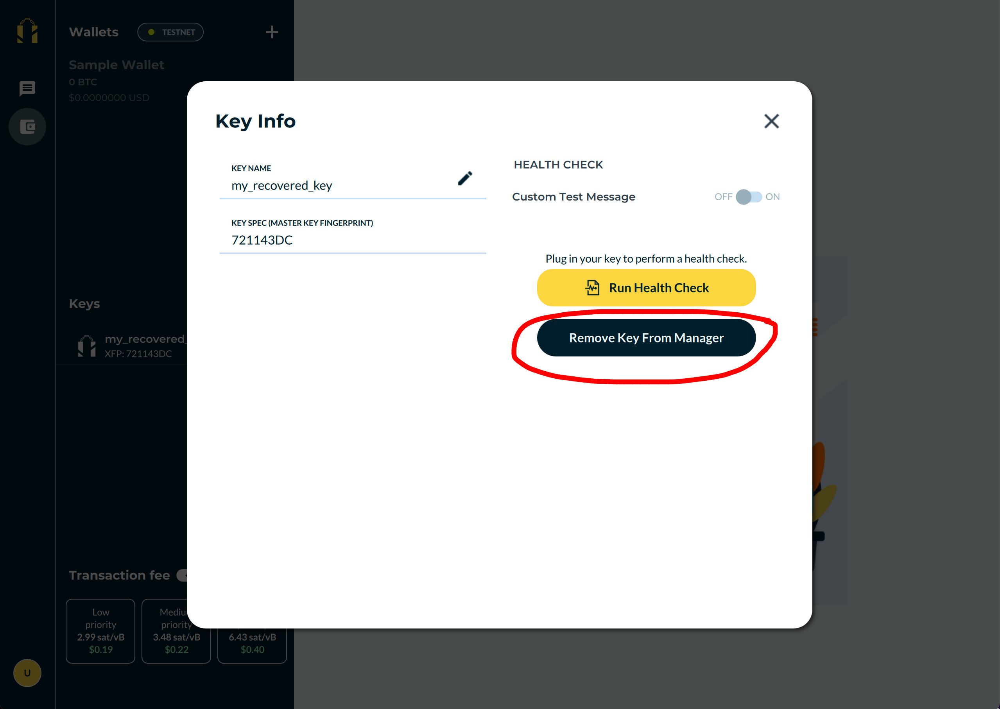
