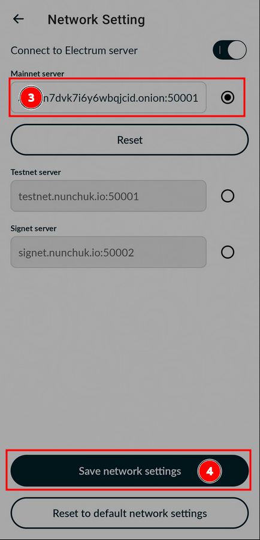

# Nunchuk Integration Setup

You will need to be running Tor on your device.  Refer to Start9's Tor guide:

https://start9.com/latest/user-manual/connecting/connecting-tor/tor-os/index

## Nunchuk mobile

**Note:** On Android, you will need to set up Nunchuk in VPN mode in Orbot.  Check the Android guide on the link above.

1. Open Nunchuk and select the Profile -> Network Settings

2. Enter your electrs Hostname and Port (found in your Embassy's electrs service page, under "Properties") into the "Mainnet server" field.

3. Save network settings then restart Nunchuk

## Nunchuk desktop

1. Open Nunchuk and go to Profile (bottom left icon) -> Settings -> Network Settings

1. Enter your electrs Hostname and Port (found in your Embassy's electrs service page, under "Properties") into the "MAINNET SERVER" field.

1. "Enable Use TOR Proxy" and then enter "127.0.0.1" for the address and "9050" for the port.

1. Save network settings then restart Nunchuk

