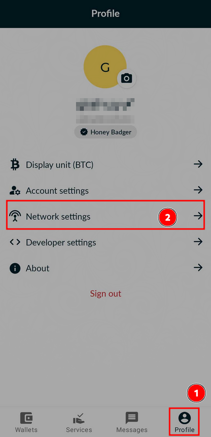
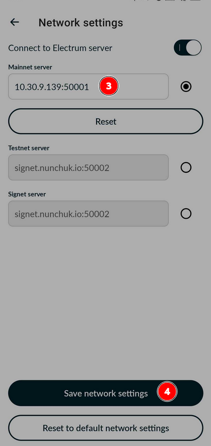
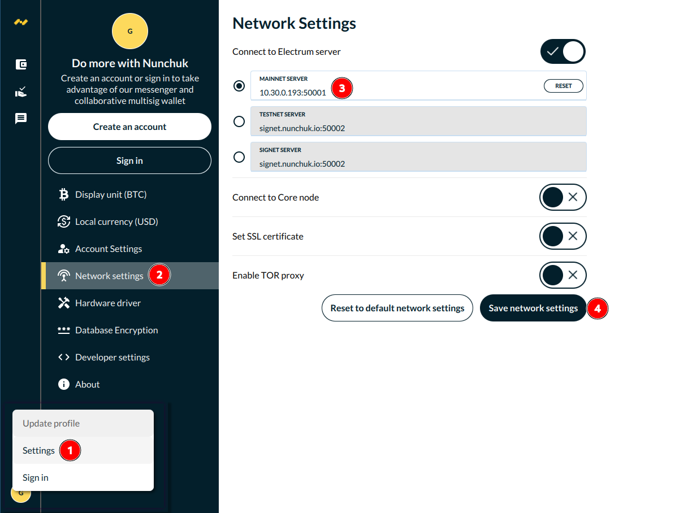
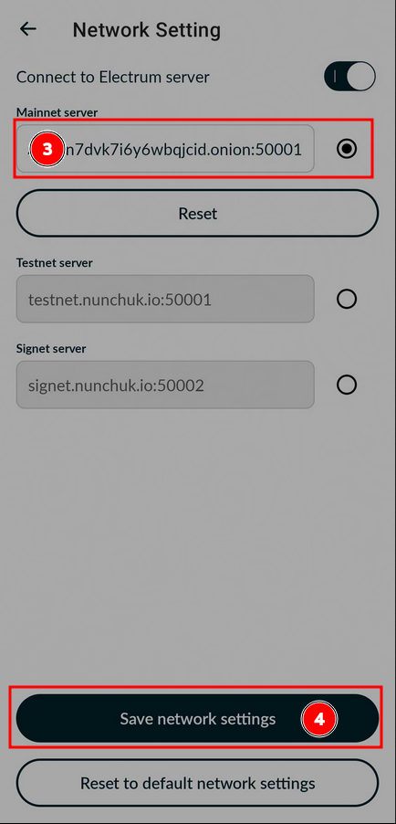
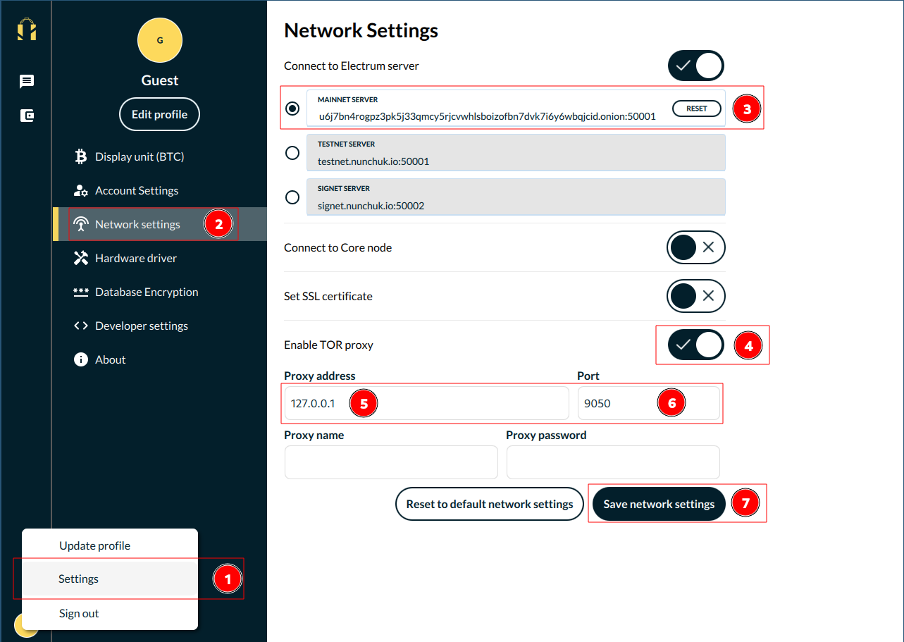

# Connect Nunchuk to Umbrel

Umbrel offers Tor and VPN (via Tailscale) for remote connection

## Using VPN:

1. Install `Electrs` on Umbrel [https://apps.umbrel.com/app/electrs](https://apps.umbrel.com/app/electrs).
2. Go to [https://tailscale.com](https://tailscale.com) and create an account.
3. Install `Tailscale` on Umbrel [https://apps.umbrel.com/app/tailscale](https://apps.umbrel.com/app/tailscale) and login with that created account.
4. Install `Tailscale` on your mobile or desktop device and login with that same created account. Immediately you will see in the app the IP of your node. It will be a private IP, not a public one. Copy it.
5. Open Nunchuk and go to Profile -> Settings -> Network Settings
6. Enter the IP you just copied followed by the `Electrs` port (50001 by default), separated by `:` into Mainnet server. For example: `10.30.9.193:50001`
7. Save network settings then restart Nunchuk

##### Mobile

  
  

##### Desktop

## Using Tor:

1. Make sure Tor is up and running on your system. Click [here](https://community.umbrel.com/t/setup-tor-on-your-system/7509) for instructions.
2. Install `Electrs` on Umbrel [https://apps.umbrel.com/app/electrs](https://apps.umbrel.com/app/electrs). Click on Tor to copy the address & port. 
3. Open Nunchuk and go to Profile -> Settings -> Network Settings
4. Enter the IP you just copied followed by the `Electrs` port (50001 by default), separated by `:` into Mainnet server.
5. Save network settings then restart Nunchuk

##### Mobile

  
  

##### Desktop
